# Buoy App - Use Case Diagram

## System Overview
The Buoy App is a React Native mobile application that monitors and displays real-time water quality data from multiple buoys. The system fetches data from an external PHP API and provides various features for data visualization, analysis, and export.

## Use Case Diagram

```mermaid
graph TB
    %% Actors
    User((User))
    API[External PHP API]
    
    %% System Boundary
    subgraph "Buoy App System"
        %% Authentication & Navigation
        Auth[Authenticate User]
        Navigate[Navigate Between Screens]
        
        %% Dashboard Features
        ViewDashboard[View Dashboard]
        SelectBuoy[Select Buoy from Dropdown]
        ViewLatestData[View Latest Buoy Data]
        ViewBuoyCard[View Buoy Card Details]
        
        %% Data Management
        FetchData[Fetch Data from API]
        ParseData[Parse HTML Data]
        CacheData[Cache Data Locally]
        
        %% Data Display Features
        ViewDataTable[View Data Table]
        NavigatePages[Navigate Through Pages]
        RefreshData[Refresh Data]
        ViewGraphs[View Data Graphs]
        
        %% Data Export
        DownloadCSV[Download CSV File]
        ShareFile[Share File]
        SaveFile[Save File to Device]
        
        %% Map Features
        ViewMap[View Buoy Map]
        ViewBuoyLocations[View Buoy Locations]
        
        %% Settings
        ViewSettings[View Settings]
        ConfigureApp[Configure App Settings]
        
        %% Error Handling
        HandleErrors[Handle API Errors]
        ShowLoading[Show Loading States]
        DisplayMessages[Display User Messages]
    end
    
    %% Relationships - User to System
    User --> Auth
    User --> Navigate
    User --> ViewDashboard
    User --> SelectBuoy
    User --> ViewLatestData
    User --> ViewBuoyCard
    User --> ViewDataTable
    User --> NavigatePages
    User --> RefreshData
    User --> ViewGraphs
    User --> DownloadCSV
    User --> ShareFile
    User --> SaveFile
    User --> ViewMap
    User --> ViewBuoyLocations
    User --> ViewSettings
    User --> ConfigureApp
    
    %% Relationships - System to API
    FetchData --> API
    ParseData --> API
    
    %% Internal System Relationships
    ViewDashboard --> FetchData
    ViewDashboard --> SelectBuoy
    ViewDashboard --> ViewLatestData
    ViewDashboard --> ViewBuoyCard
    
    ViewDataTable --> FetchData
    ViewDataTable --> NavigatePages
    ViewDataTable --> RefreshData
    ViewDataTable --> DownloadCSV
    
    DownloadCSV --> FetchData
    DownloadCSV --> ShareFile
    DownloadCSV --> SaveFile
    
    ViewGraphs --> FetchData
    ViewMap --> FetchData
    
    %% Error Handling Relationships
    FetchData --> HandleErrors
    ParseData --> HandleErrors
    ViewDashboard --> ShowLoading
    ViewDataTable --> ShowLoading
    DownloadCSV --> ShowLoading
    HandleErrors --> DisplayMessages
    
    %% Styling
    classDef actor fill:#e1f5fe,stroke:#01579b,stroke-width:2px
    classDef system fill:#f3e5f5,stroke:#4a148c,stroke-width:2px
    classDef api fill:#fff3e0,stroke:#e65100,stroke-width:2px
    
    class User actor
    class API api
    class Auth,Navigate,ViewDashboard,SelectBuoy,ViewLatestData,ViewBuoyCard,FetchData,ParseData,CacheData,ViewDataTable,NavigatePages,RefreshData,ViewGraphs,DownloadCSV,ShareFile,SaveFile,ViewMap,ViewBuoyLocations,ViewSettings,ConfigureApp,HandleErrors,ShowLoading,DisplayMessages system
```

## Detailed Use Case Descriptions

### Primary Actors
1. **User** - The mobile app user who interacts with the buoy monitoring system

### Secondary Actors
1. **External PHP API** - Provides buoy data from the database

### Core Use Cases

#### 1. **View Dashboard**
- **Actor**: User
- **Description**: User views the main dashboard showing latest buoy data
- **Preconditions**: App is loaded and authenticated
- **Main Flow**:
  1. User opens the app
  2. System fetches latest data from API
  3. System displays buoy cards with latest readings
  4. User can select specific buoys from dropdown

#### 2. **Select Buoy**
- **Actor**: User
- **Description**: User selects a specific buoy to view its latest data
- **Preconditions**: Dashboard is loaded
- **Main Flow**:
  1. User taps dropdown on dashboard
  2. System shows available buoy numbers
  3. User selects a buoy
  4. System fetches and displays latest data for selected buoy
  5. System shows loading indicator during fetch

#### 3. **View Data Table**
- **Actor**: User
- **Description**: User views all historical buoy data in paginated table format
- **Preconditions**: User navigates to Data tab
- **Main Flow**:
  1. User taps Data tab
  2. System fetches first page of data (10 records)
  3. System displays data in table format
  4. User can navigate through pages
  5. User can refresh data

#### 4. **Download CSV**
- **Actor**: User
- **Description**: User downloads all buoy data as CSV file for Excel analysis
- **Preconditions**: User is on Data screen
- **Main Flow**:
  1. User taps "Download CSV" button
  2. System shows confirmation dialog
  3. User confirms download
  4. System fetches ALL data from API
  5. System converts data to CSV format
  6. System creates file with timestamp
  7. System opens native sharing dialog
  8. User saves or shares the file

#### 5. **View Graphs**
- **Actor**: User
- **Description**: User views graphical representations of buoy data
- **Preconditions**: User navigates to Graph tab
- **Main Flow**:
  1. User taps Graph tab
  2. System fetches data for graph visualization
  3. System displays charts and graphs
  4. User can view different data metrics

#### 6. **View Map**
- **Actor**: User
- **Description**: User views buoy locations on a map
- **Preconditions**: User navigates to Map tab
- **Main Flow**:
  1. User taps Map tab
  2. System fetches buoy location data
  3. System displays map with buoy markers
  4. User can view buoy positions

#### 7. **Handle Errors**
- **Actor**: System
- **Description**: System handles API errors and network issues
- **Preconditions**: Error occurs during data fetching
- **Main Flow**:
  1. System detects error
  2. System displays appropriate error message
  3. System provides retry options
  4. System logs error for debugging

## System Features Summary

### **Core Features**
- ✅ **Real-time Data Monitoring** - Latest buoy readings
- ✅ **Multi-buoy Support** - Select specific buoys
- ✅ **Historical Data View** - Paginated data table
- ✅ **Data Export** - CSV download with all data
- ✅ **Data Visualization** - Graphs and charts
- ✅ **Geographic View** - Map with buoy locations
- ✅ **Responsive Design** - Mobile-optimized interface

### **Technical Features**
- ✅ **API Integration** - External PHP API connection
- ✅ **Data Parsing** - HTML to structured data conversion
- ✅ **Pagination** - Efficient data loading
- ✅ **File Sharing** - Native device sharing
- ✅ **Error Handling** - Graceful error management
- ✅ **Loading States** - User feedback during operations

This Use Case diagram shows the complete system architecture and user interactions for the Buoy App, demonstrating how users can monitor, analyze, and export water quality data from multiple buoys.
